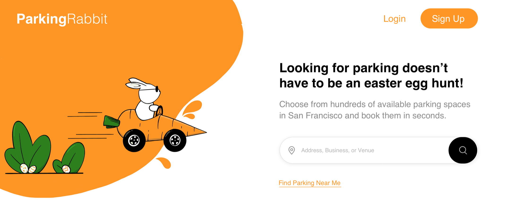
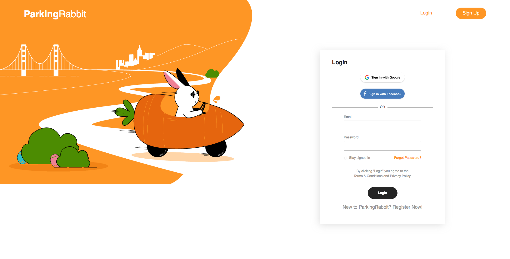
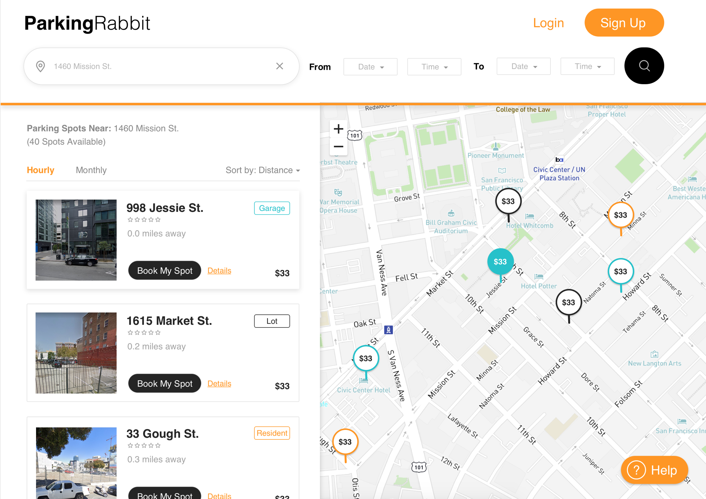
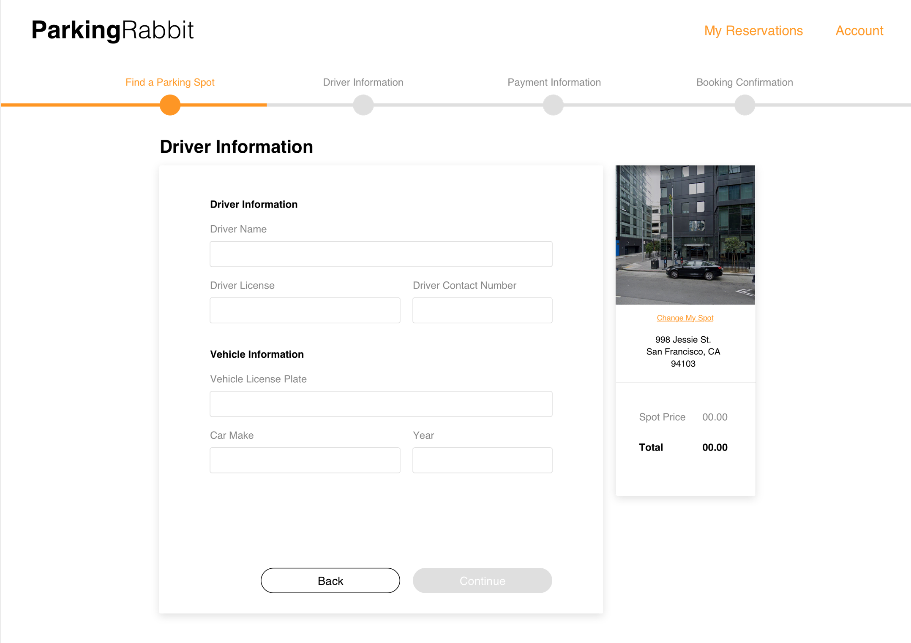

# ParkingRabbit v1.0

### [Visit the live site](https://www.parkingrabbit.me/)

### [x] [ParkingRabbit Front-end Repo](https://github.com/willdiep/parkingrabbit-frontend)

### [ParkingRabbit Back-end Repo](https://github.com/willdiep/parkingrabbit-backend)


ParkingRabbit is a single-page, full-stack application to reserve parking spots in San Francisco. It uses React on the front-end and Ruby on Rails with a PostgresSQl database on the back-end. 









## Table Of Content
- [ParkingRabbit v1.0](#parkingrabbit-v10)
    - [Visit the live site](#visit-the-live-site)
    - [[x] ParkingRabbit Front-end Repo](#x-parkingrabbit-front-end-repo)
    - [ParkingRabbit Back-end Repo](#parkingrabbit-back-end-repo)
  - [Table Of Content](#table-of-content)
    - [1. Technologies](#1-technologies)
    - [2. Setup](#2-setup)
      - [Prerequisites](#prerequisites)
      - [Frontend Setup](#frontend-setup)
      - [Backend Setup](#backend-setup)
    - [3. Upcoming Features For Version 2](#3-upcoming-features-for-version-2)
    - [4. Design Documents Wiki](#4-design-documents-wiki)
      - [MVP List](#mvp-list)
      - [Schema](#schema)
      - [Frontend Routes](#frontend-routes)
      - [Backend Routes](#backend-routes)
    - [5. React Component Hierarchy](#5-react-component-hierarchy)
    - [6. Domain Model](#6-domain-model)
    - [7. User Flow Diagram](#7-user-flow-diagram)
    - [8. Key features](#8-key-features)
      - [User Authentication](#user-authentication)
      - [Listings + Search](#listings--search)
      - [Bookings](#bookings)
      - [Reviews](#reviews)

***


### 1. Technologies

* React
* Ruby on Rails
* PostgresSQL
* Javascript
* HTML/CSS
* Local Storage
* JSON Web Tokens
* BEM methodology 
* Mapbox API
* Algolia Places API


### 2. Setup

#### Prerequisites
- React
- Rails v5.1.4
- PostgreSQL 10

#### Frontend Setup
1. Clone current repo -> https://github.com/willdiep/parkingrabbit-frontend
2. Install dependencies `npm install` or `yarn add`
3. Create an `.env` file on the root directory. Add three variables:
   * REACT_APP_MAPBOX_API_KEY
   * REACT_APP_ALGOLIA_PLACES_APP_ID
   * REACT_APP_ALGOLIA_PLACES_APP_KEY
4. Navigate to [Mapbox](www.mapbox.com) and [Algolia](https://www.algolia.com/) to create accounts and generate free Mapbox GL JS and Algolia Places API keys. Paste the API keys after each respective variable in string formats such as:

.env
```
REACT_APP_MAPBOX_API_KEY = '[ENTER API KEY HERE]'

REACT_APP_ALGOLIA_PLACES_APP_ID = '[ENTER API ID HERE]'

REACT_APP_ALGOLIA_PLACES_APP_KEY = '[ENTER API KEY HERE]'
```
5. Start your server `npm start` or `yarn start`
6. Navigate to the web address `http://localhost:3000`

#### Backend Setup
2. Clone this repo -> https://github.com/willdiep/parkingrabbit-backend
3. Install Gems `bundle install`
4. Set up database `rails db:create`, then migrate database `rails db:migrate`
5. Seed database `rails db:seed`
6. Start your server `rails s`
7. Navigate to the web address `http://localhost:4000`

Please send a pull request if you have any question regarding setting up. I will try to reply within 48 hours.


### 3. Upcoming Features For Version 2

1. My Reservation component
2. Account component to update email, password, and terminate account
3. Additional Square payment option
4. Email confirmation and SMS booking reminder via Twilio API


### 4. [Design Documents Wiki](https://github.com/willdiep/parkingrabbit-frontend/wiki)
  
#### [MVP List](https://github.com/willdiep/parkingrabbit-frontend/wiki/MVP-List)
#### [Schema](https://github.com/willdiep/parkingrabbit-frontend/wiki/Schema)
#### [Frontend Routes](https://github.com/willdiep/parkingrabbit-frontend/wiki/Frontend-Routes)
#### [Backend Routes](https://github.com/willdiep/parkingrabbit-frontend/wiki/Backend-Routes)
  

### 5. React Component Hierarchy
(Click to enlarge)


### 6. Domain Model
(Click to enlarge)


### 7. User Flow Diagram
(Click to enlarge)


### 8. Key features

#### User Authentication

* Users can sign up or log in with an existing account.
* Invalid login or signup attempts would trigger both front-end and back-end errors.

<!--  -->

* Logged in users can access features such as viewing parking listings based on location, filtering listings by date and time, leaving reviews, 
  and booking parking spaces.
* Users not logged in cannot leave reviews or book parking spaces
* Only logged out users can view the splash page. Logged in users are redirected to the listing index page.

```
class User < ApplicationRecord
  validates :password_digest, :fname, :lname, presence: true
  validates :email, :session_token, presence: true, uniqueness: true
  validates :password, length: {minimum: 6}, allow_nil: true

  attr_reader :password
  after_initialize :ensure_session_token
 
  // ...
  
  def self.find_by_credentials(email, password)
    user = User.find_by(email: email)
    return user if user && user.is_password?(password)
    nil
  end

  def is_password?(password)
    BCrypt::Password.new(self.password_digest).is_password?(password)
  end

  def self.generate_session_token
    SecureRandom::urlsafe_base64
  end

  def password=(password)
    @password = password
    self.password_digest = BCrypt::Password.create(password)
  end

  def ensure_session_token
    self.session_token ||= User.generate_session_token
  end

  def reset_session_token!
    self.session_token = User.generate_session_token
    self.save!
    self.session_token
  end

end
```

#### Listings + Search
* Listings are shown according to the position of the map. As users zoom out and move around, more listings are displayed.

<!--  -->
```
class Listing < ApplicationRecord
  //...

  def self.in_bounds(bounds)
    self.where("lat < ?", bounds[:northEast][:lat])
        .where("lat > ?", bounds[:southWest][:lat])
        .where("long > ?", bounds[:southWest][:lng])
        .where("long < ?", bounds[:northEast][:lng])
  end
  
  //...
end
```

* Users are able to search for listings with Google Maps Places API, namely the Autocomplete widget.
* Users can filter listings based on availability by selecting a date range on the splash page. Unavailable listings will not be displayed.


```
class ListingMap extends React.Component {
  constructor(props) {
    super(props);
    this.searchParams = new URLSearchParams(`${this.props.history.location.hash}`);
    const lat = parseFloat(this.searchParams.get('lat')) || 40.716880; 
    const long = parseFloat(this.searchParams.get('long')) || -73.948810;
    const startDate = this.searchParams.get('checkin') || null;
    const endDate = this.searchParams.get('checkout') || null;
    this.center = {
      lat: lat,
      lng: long
    }
    this.mapOptions = {
      center: this.center,
      zoom: 8
    }
    this.dates = {
      startDate: startDate,
      endDate: endDate
    }
  }

  componentDidMount() {
    this.map = new google.maps.Map(this.mapNode, this.mapOptions);
    this.MarkerManager = new MarkerManager(this.map);
    this.registerListeners();
    this.MarkerManager.updateMarkers(this.props.listings);
  }
  
 //...

  registerListeners() {
    google.maps.event.addListener(this.map, 'idle', () => {
      const directions = this.map.getBounds().toJSON();
      const bounds = {
        northEast: { lat: directions.north, lng: directions.east },
        southWest: { lat: directions.south, lng: directions.west }
      }
      
      this.props.updateFilter({
        "bounds": bounds,
        "dates": this.dates
      })
    })
  }
  
  //...
}
```
* Every listing comes with a short text description, location information, a section for amenities with modal functionality to view more, host information, availability information, reviews, and a map displaying the neighborhood.

#### Bookings
* Users are able to book listings for a given date range. If the listing is unavailable during those dates, users will not be permitted to select those dates.


```
class Listing < ApplicationRecord
  //...

  def self.available_in_bounds(bounds, dates)
    overlap = Booking.select('listing_id')
                     .where('? BETWEEN start_date AND end_date
                            OR ? BETWEEN start_date AND end_date',
                            dates[:startDate], dates[:endDate])

    too_long = Booking.select('listing_id')
                       .where('? < start_date AND ? > end_date',
                              Date.parse(dates[:startDate]), Date.parse(dates[:endDate]))
    self.in_bounds(bounds).where.not(id: overlap).where.not(id: too_long)
  end
end
```

* Users are able to access their own bookings under the "Trips" section of the navigational bar dropdown.
* Users are only able to cancel bookings if the start date has not yet occurred.
* Users are only able to write reviews for bookings if the end date has already passed.

<!--  -->

```
class BookingIndexItem extends React.Component {
    // ...
    
    render() {
      const cancelButton = moment(booking.start_date).isAfter(moment(), 'day') ? (
        <button onClick={() => this.cancelBooking(booking.id)} className='cancel-booking-button'>
          Cancel Booking
            </button>
      ) : (
          null
        )

      const reviewButton = moment(booking.end_date).isBefore(moment(), 'day') ? (
        <button onClick={() => dispatch(openReviewModal('create-review', booking.listing.id))} className='review-button'>
          Write Review
        </button>
      ) : (
        null
      )

    // ...
  }
}
```

#### Reviews
* Users are able to write reviews for past bookings and also provide ratings in the form of stars, from one to five.
* Users are able to rate bookings across six categories — accuracy, communication, cleanliness, location, check-in, and value.

<!--  -->

* Listings display an overall average rating that is recalculated every time a new rating is submitted.
* Listings also display an average rating for each of the six categories. Each category rating is also recalculated every time a new rating is submitted.

```
class ReviewIndex extends React.Component {
  //...
  
  findAvgRating() {
    const { reviews } = this.props;
    const ratings = { 
      accuracy: 0, 
      communication: 0,
      cleanliness: 0,
      location: 0,
      check_in: 0,
      value: 0
    }

    for (let i = 0; i < reviews.length; i++) {
      let review = reviews[i];
      
      for (let key in ratings) {
        ratings[key] += review[key]
      }
    }

    for (let key in ratings) {
      ratings[key] = (ratings[key] / reviews.length)
    }

    return ratings;
  }
  
  //...
}
```
