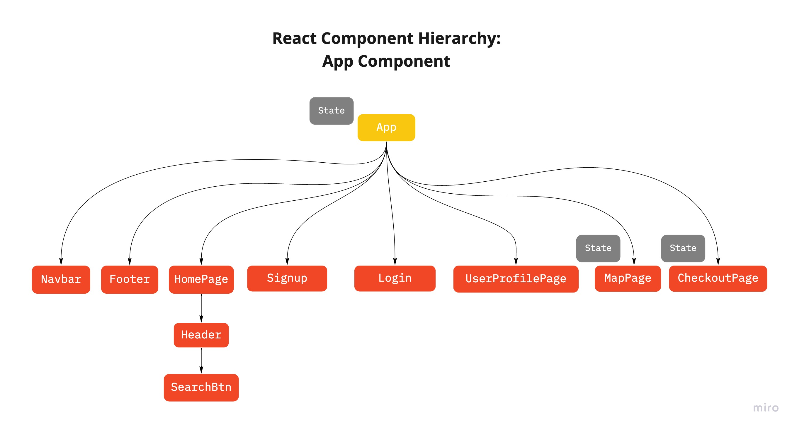
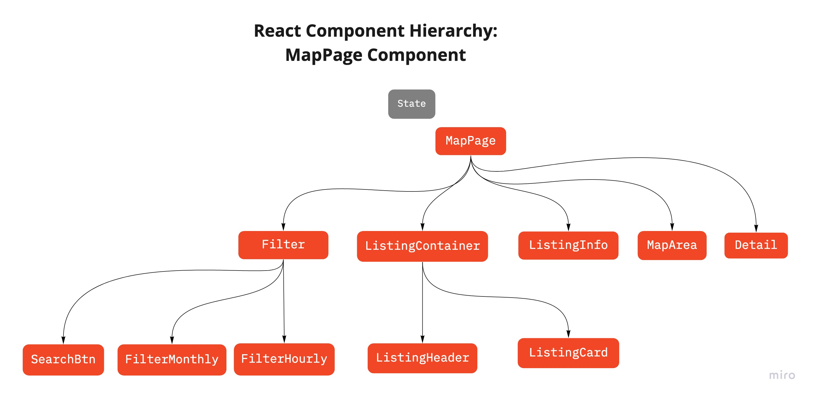
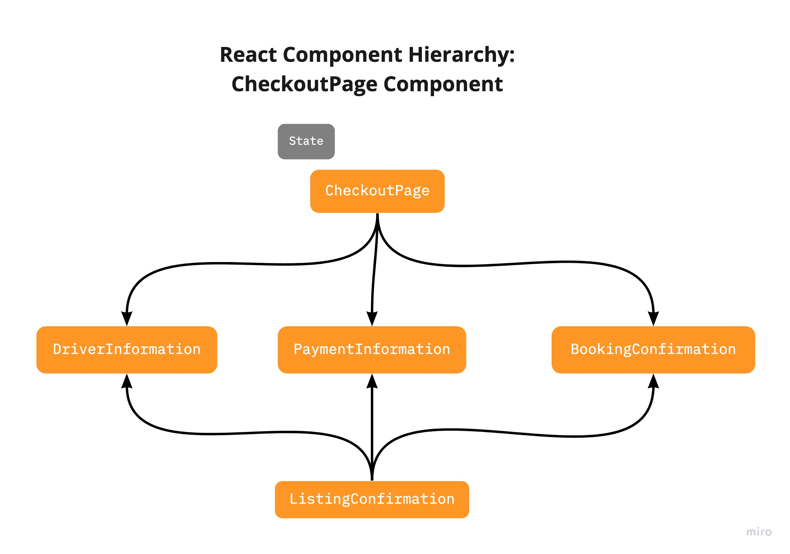
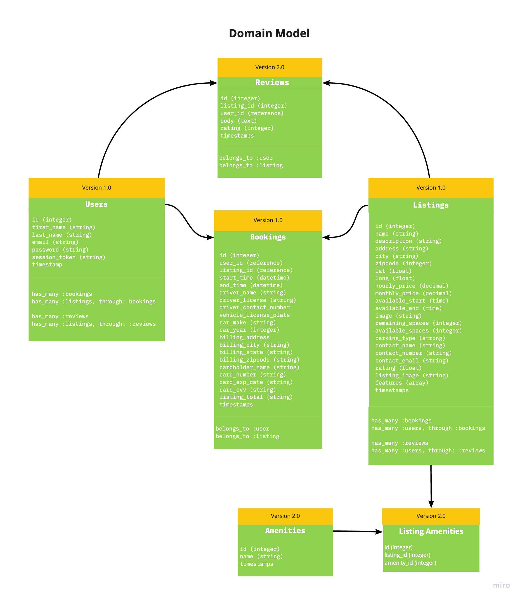
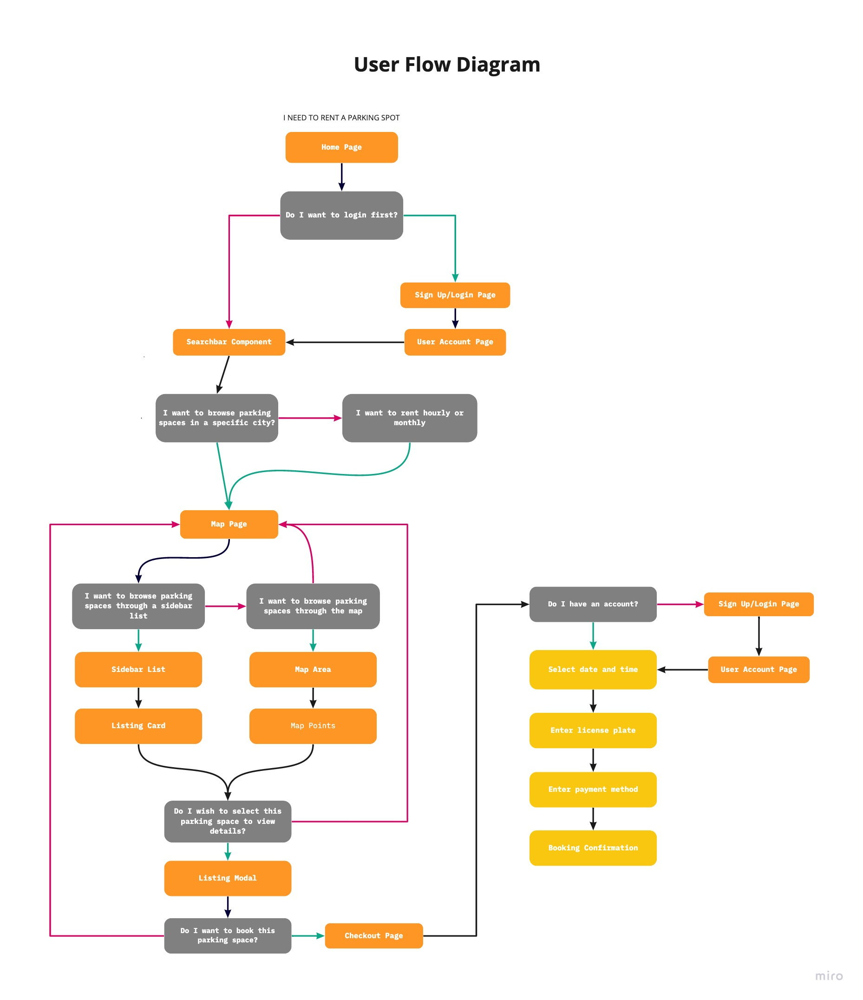

# Parking Rabbit

### [Visit the live site](https://parkingrabbit.herokuapp.com/)

### [x] [ParkingRabbit Front-end Repo](https://github.com/willdiep/parkingrabbit-frontend)

### [ParkingRabbit Back-end Repo](https://github.com/willdiep/parkingrabbit-backend)


ParkingRabbit is a single-page, full-stack application to reserve parking spots in San Francisco. It uses React on the front-end as well as Ruby on Rails with a PostgresSQl database on the back-end. 


## Table Of Content
- [Parking Rabbit](#parking-rabbit)
    - [Visit the live site](#visit-the-live-site)
    - [[x] ParkingRabbit Front-end Repo](#x-parkingrabbit-front-end-repo)
    - [ParkingRabbit Back-end Repo](#parkingrabbit-back-end-repo)
  - [Table Of Content](#table-of-content)
    - [1. Technologies](#1-technologies)
    - [2. React Component Hierarchy](#2-react-component-hierarchy)
    - [3. Domain Model](#3-domain-model)
    - [4. User Flow Diagram](#4-user-flow-diagram)
    - [5. Design Documents Wiki](#5-design-documents-wiki)
    - [6. Key features](#6-key-features)
      - [User Authentication](#user-authentication)
      - [Listings + Search](#listings--search)
      - [Bookings](#bookings)
      - [Reviews](#reviews)
      - [User Profiles + Messaging](#user-profiles--messaging)
  - [Available Scripts](#available-scripts)
    - [`yarn start`](#yarn-start)
    - [`yarn test`](#yarn-test)
    - [`yarn build`](#yarn-build)
    - [`yarn eject`](#yarn-eject)
  - [Learn More](#learn-more)
    - [Deployment](#deployment)
    - [`yarn build` fails to minify](#yarn-build-fails-to-minify)

***


### 1. Technologies

* React
* Ruby on Rails
* PostgresSQL
* Javascript
* HTML/CSS
* Local Storage
* JSON Web Tokens
* BEM methodology 
* Mapbox API
* Algolia Places API


### 2. React Component Hierarchy
(Click to enlarge)







### 3. Domain Model
(Click to enlarge)




### 4. User Flow Diagram
(Click to enlarge)



### 5. [Design Documents Wiki](https://github.com/willdiep/parkingrabbit-frontend/wiki)
  
- #### [MVP List](https://github.com/willdiep/parkingrabbit-frontend/wiki)
- #### [Schema](https://github.com/willdiep/parkingrabbit-frontend/wiki)
- #### [Sample State](https://github.com/willdiep/parkingrabbit-frontend/wiki)
- #### [Backend Routes](https://github.com/willdiep/parkingrabbit-frontend/wiki)
- #### [Frontend Routes](https://github.com/willdiep/parkingrabbit-frontend/wiki)
  


### 6. Key features

#### User Authentication

* Users can sign up or log in with an existing account.
* Invalid login or signup attempts would trigger both front-end and back-end errors.

<!--  -->

* Logged in users can access features such as viewing parking listings based on location, filtering listings by date and time, leaving reviews, 
  and booking parking spaces.
* Users not logged in cannot leave reviews or book parkkng spaces
* Only logged out users can view the splash page. Logged in users are redirected to the listing index page.

```
class User < ApplicationRecord
  validates :password_digest, :fname, :lname, presence: true
  validates :email, :session_token, presence: true, uniqueness: true
  validates :password, length: {minimum: 6}, allow_nil: true

  attr_reader :password
  after_initialize :ensure_session_token
 
  // ...
  
  def self.find_by_credentials(email, password)
    user = User.find_by(email: email)
    return user if user && user.is_password?(password)
    nil
  end

  def is_password?(password)
    BCrypt::Password.new(self.password_digest).is_password?(password)
  end

  def self.generate_session_token
    SecureRandom::urlsafe_base64
  end

  def password=(password)
    @password = password
    self.password_digest = BCrypt::Password.create(password)
  end

  def ensure_session_token
    self.session_token ||= User.generate_session_token
  end

  def reset_session_token!
    self.session_token = User.generate_session_token
    self.save!
    self.session_token
  end

end
```

#### Listings + Search
* Listings are shown according to the position of the map. As users zoom out and move around, more listings are displayed.

<!--  -->
```
class Listing < ApplicationRecord
  //...

  def self.in_bounds(bounds)
    self.where("lat < ?", bounds[:northEast][:lat])
        .where("lat > ?", bounds[:southWest][:lat])
        .where("long > ?", bounds[:southWest][:lng])
        .where("long < ?", bounds[:northEast][:lng])
  end
  
  //...
end
```

* Users are able to search for listings with Google Maps Places API, namely the Autocomplete widget.
* Users can filter listings based on availability by selecting a date range on the splash page. Unavailable listings will not be displayed.


```
class ListingMap extends React.Component {
  constructor(props) {
    super(props);
    this.searchParams = new URLSearchParams(`${this.props.history.location.hash}`);
    const lat = parseFloat(this.searchParams.get('lat')) || 40.716880; 
    const long = parseFloat(this.searchParams.get('long')) || -73.948810;
    const startDate = this.searchParams.get('checkin') || null;
    const endDate = this.searchParams.get('checkout') || null;
    this.center = {
      lat: lat,
      lng: long
    }
    this.mapOptions = {
      center: this.center,
      zoom: 8
    }
    this.dates = {
      startDate: startDate,
      endDate: endDate
    }
  }

  componentDidMount() {
    this.map = new google.maps.Map(this.mapNode, this.mapOptions);
    this.MarkerManager = new MarkerManager(this.map);
    this.registerListeners();
    this.MarkerManager.updateMarkers(this.props.listings);
  }
  
 //...

  registerListeners() {
    google.maps.event.addListener(this.map, 'idle', () => {
      const directions = this.map.getBounds().toJSON();
      const bounds = {
        northEast: { lat: directions.north, lng: directions.east },
        southWest: { lat: directions.south, lng: directions.west }
      }
      
      this.props.updateFilter({
        "bounds": bounds,
        "dates": this.dates
      })
    })
  }
  
  //...
}
```
* Every listing comes with a short text description, location information, a section for amenities with modal functionality to view more, host information, availability information, reviews, and a map displaying the neighborhood.

#### Bookings
* Users are able to book listings for a given date range. If the listing is unavailable during those dates, users will not be permitted to select those dates.


```
class Listing < ApplicationRecord
  //...

  def self.available_in_bounds(bounds, dates)
    overlap = Booking.select('listing_id')
                     .where('? BETWEEN start_date AND end_date
                            OR ? BETWEEN start_date AND end_date',
                            dates[:startDate], dates[:endDate])

    too_long = Booking.select('listing_id')
                       .where('? < start_date AND ? > end_date',
                              Date.parse(dates[:startDate]), Date.parse(dates[:endDate]))
    self.in_bounds(bounds).where.not(id: overlap).where.not(id: too_long)
  end
end
```

* Users are able to access their own bookings under the "Trips" section of the navigational bar dropdown.
* Users are only able to cancel bookings if the start date has not yet occurred.
* Users are only able to write reviews for bookings if the end date has already passed.

<!--  -->

```
class BookingIndexItem extends React.Component {
    // ...
    
    render() {
      const cancelButton = moment(booking.start_date).isAfter(moment(), 'day') ? (
        <button onClick={() => this.cancelBooking(booking.id)} className='cancel-booking-button'>
          Cancel Booking
            </button>
      ) : (
          null
        )

      const reviewButton = moment(booking.end_date).isBefore(moment(), 'day') ? (
        <button onClick={() => dispatch(openReviewModal('create-review', booking.listing.id))} className='review-button'>
          Write Review
        </button>
      ) : (
        null
      )

    // ...
  }
}
```

#### Reviews
* Users are able to write reviews for past bookings and also provide ratings in the form of stars, from one to five.
* Users are able to rate bookings across six categories — accuracy, communication, cleanliness, location, check-in, and value.

<!--  -->

* Listings display an overall average rating that is recalculated every time a new rating is submitted.
* Listings also display an average rating for each of the six categories. Each category rating is also recalculated every time a new rating is submitted.

```
class ReviewIndex extends React.Component {
  //...
  
  findAvgRating() {
    const { reviews } = this.props;
    const ratings = { 
      accuracy: 0, 
      communication: 0,
      cleanliness: 0,
      location: 0,
      check_in: 0,
      value: 0
    }

    for (let i = 0; i < reviews.length; i++) {
      let review = reviews[i];
      
      for (let key in ratings) {
        ratings[key] += review[key]
      }
    }

    for (let key in ratings) {
      ratings[key] = (ratings[key] / reviews.length)
    }

    return ratings;
  }
  
  //...
}
```

#### User Profiles + Messaging
* Users are able to access their own profile under the "Profile" section of the navigational bar dropdown.
* Users can visit a host's profile by clicking on the host's name on the listing page.
* Profiles display a short text description as well as the user's listings. If the user has no listings, it will say that the user has no listings at this time.
* Users are able to send live messages to each other with a button accessible on every user's profile page.

<!--  -->

```
class ChatChannel < ApplicationCable::Channel
  def subscribed 
    @chat_channel = Channel.first
    stream_for @chat_channel
  end

  def speak(data)
    message_data = data["message"]
    @message = @chat_channel.messages.new(body: message_data['body'])
    @message.author_id = current_user.id
    @message.channel_id = @chat_channel.id
    if @message.save 
      socket = { message: @message, type: "message" }
      ChatChannel.broadcast_to(@chat_channel, socket)
    end
  end 

  def load 
    messages = Message.all.collect(&:body)
    socket = { messages: messages, type: "messages" }
    ChatChannel.broadcast_to(@chat_channel, socket)
  end
end
```


```
class ChatRoom extends React.Component {
  //...

  componentDidMount() {
    App.cable.subscriptions.create(
      { channel: 'ChatChannel' }, 
      {
        received: data => {
          if (!this.props.users[data.message.author_id]) {
            this.props.fetchUser(data.message.author_id).then(() => this.props.receiveMessage(data.message))
          } else {
            this.props.receiveMessage(data.message)
          }
        },
        speak: function(data) {
          return this.perform('speak', data)
        }
      }
    )
    this.props.fetchMessages(1);
  }
  
  //...
}
```


This project was bootstrapped with [Create React App](https://github.com/facebook/create-react-app).

## Available Scripts

In the project directory, you can run:

### `yarn start`

Runs the app in the development mode.<br />
Open [http://localhost:3000](http://localhost:3000) to view it in the browser.

The page will reload if you make edits.<br />
You will also see any lint errors in the console.

### `yarn test`

Launches the test runner in the interactive watch mode.<br />
See the section about [running tests](https://facebook.github.io/create-react-app/docs/running-tests) for more information.

### `yarn build`

Builds the app for production to the `build` folder.<br />
It correctly bundles React in production mode and optimizes the build for the best performance.

The build is minified and the filenames include the hashes.<br />
Your app is ready to be deployed!

See the section about [deployment](https://facebook.github.io/create-react-app/docs/deployment) for more information.

### `yarn eject`

**Note: this is a one-way operation. Once you `eject`, you can’t go back!**

If you aren’t satisfied with the build tool and configuration choices, you can `eject` at any time. This command will remove the single build dependency from your project.

Instead, it will copy all the configuration files and the transitive dependencies (Webpack, Babel, ESLint, etc) right into your project so you have full control over them. All of the commands except `eject` will still work, but they will point to the copied scripts so you can tweak them. At this point you’re on your own.

You don’t have to ever use `eject`. The curated feature set is suitable for small and middle deployments, and you shouldn’t feel obligated to use this feature. However we understand that this tool wouldn’t be useful if you couldn’t customize it when you are ready for it.

## Learn More

### Deployment

This section has moved here: https://facebook.github.io/create-react-app/docs/deployment

### `yarn build` fails to minify

This section has moved here: https://facebook.github.io/create-react-app/docs/troubleshooting#npm-run-build-fails-to-minify
